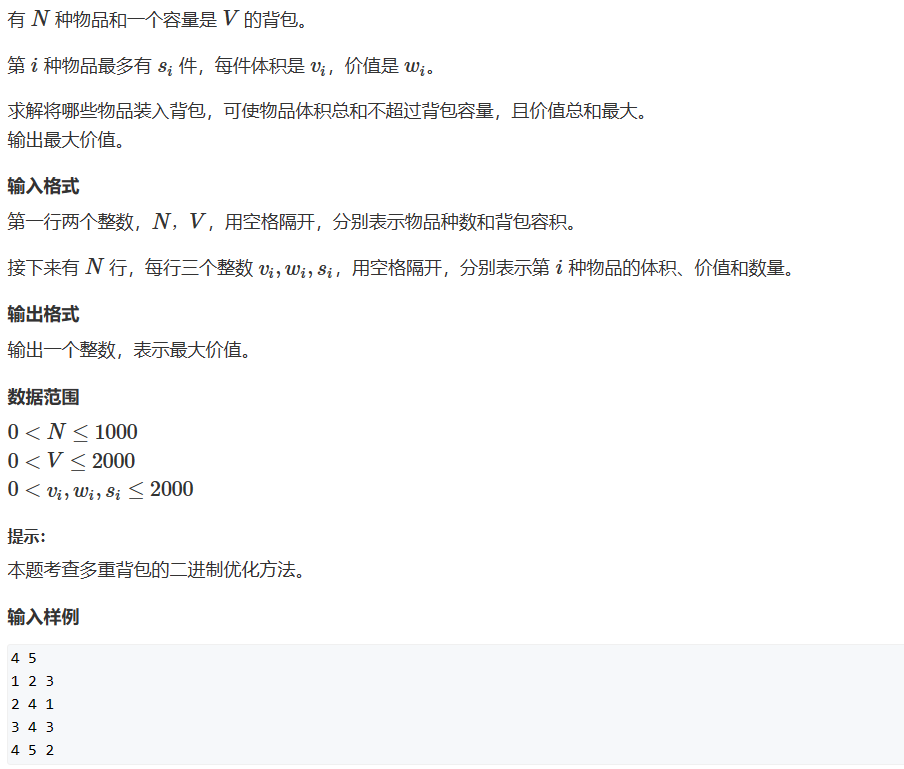
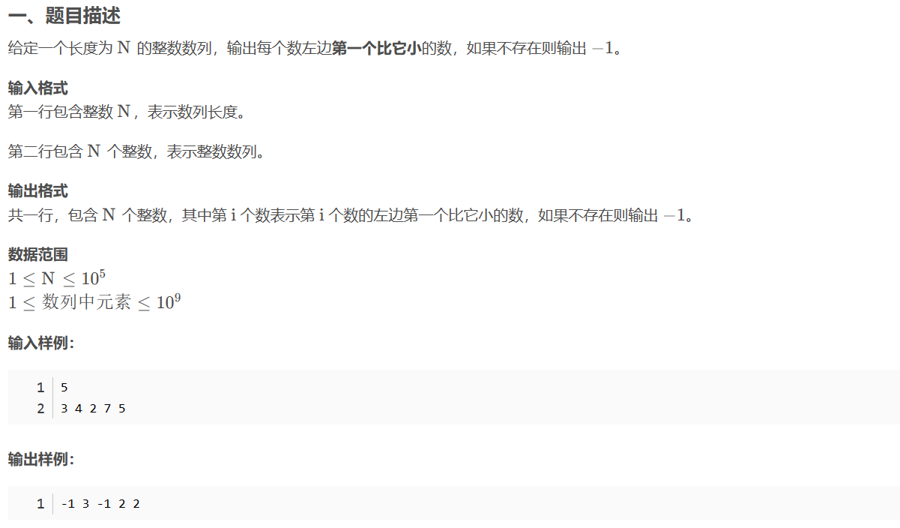
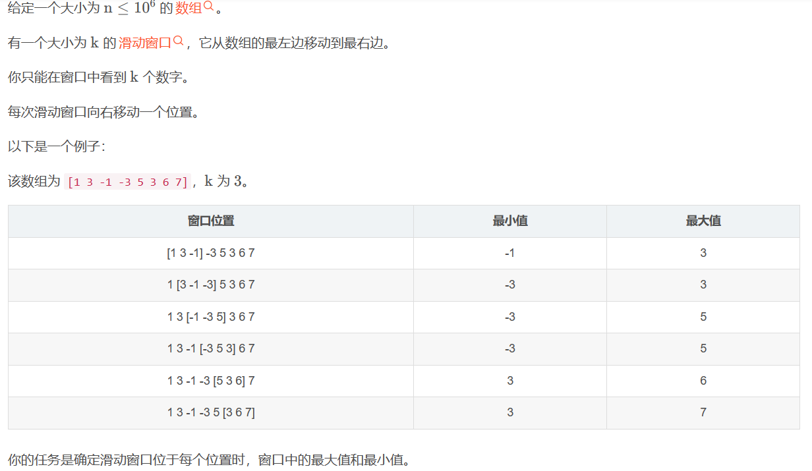
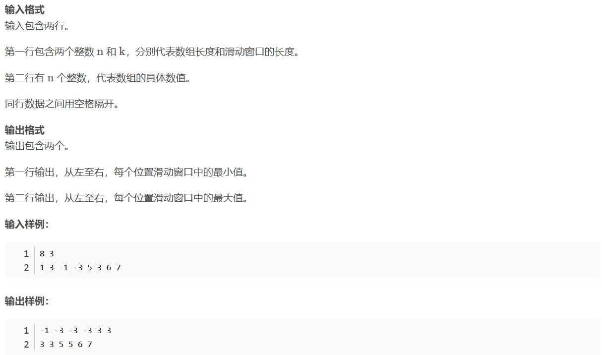
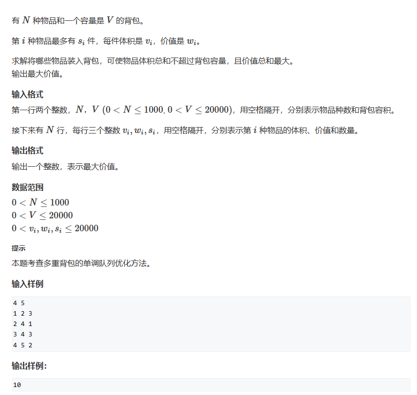

* 多重背包问题配合二进制优化

求解过程中注意到，si的值较大，此时可以用二进制优化的方式来进行解决，本质上就是类似将一个数用二进制进行表示（一开始原始方法是类似1+1+1+...的方式），现在也就是转化为1+2+4+...+rest=si的形式。对于小于si的每一个数都可以用1，2，4，...，rest来表示，且每个数能保证至多使用一次，因此二进制优化是合理的。
**困扰点：对于si-rest到si之间的数如何表示产生疑问，后来想到能用1，2，4，...表示si-2*rest到si-rest之间的数，再加上rest就能表示si-rest到si之间的数**
最终的时间复杂度为o(NV*logs)
最终解决的代码如下所示：
```c++
#include<iostream>
#include<vector>
int main()
{
    int num;
    int total_weight;
    std::cin>>num>>total_weight;
    std::vector<int> weight(2000000,0);
    std::vector<int> value(2000000,0);
    int tmp1;
    int tmp2;
    int tmp3;
    int count1=0;
    int count2=0;
    int k;
    for(int i=0;i<num;i++)
    {
        std::cin>>tmp1>>tmp2>>tmp3;
        for(k=1;k<=tmp3;k*=2)
        {
            weight[count1++]=k*tmp1;
            value[count2++]=k*tmp2;
            tmp3-=k;
        }
        if(tmp3>0)
        {
            weight[count1++]=tmp3*tmp1;
            value[count2++]=tmp3*tmp2;
        }
    }
    std::vector<int> dp(total_weight+1,0);
    for(int i=0;i<count1;i++)
    {
        for(int j=total_weight;j>=weight[i];j--)
        {
            dp[j]=std::max(dp[j],dp[j-weight[i]]+value[i]);
        }
    }
    std::cout<<dp[total_weight]<<std::endl;
    return 0;
}
```
---
* 单调栈

暴力方法需要O(n^2)的时间复杂度，运用单调栈的思想，这里将构造一个栈，从栈顶到栈底单调递减
```c++
#include<iostream>
const int N = 1e5 + 10;
int stk[N],tt;
int main()
{
    int n;
    std::cin>>n;
    int tmp;
    for(int i=0;i<n;i++)
    {
        std::cin>>tmp;
        while(tt>0&&stk[tt]>=tmp) tt--;
        if(tt) printf("%d ",stk[tt]);
        else printf("-1 ");
        stk[++tt]=tmp;
    }
    return 0;
}
```
---
* 滑动窗口


该问题运用单调栈的思想，又因为有窗口大小的限制，因此想到运用单调队列，**队尾运用单调栈的思想，队头要保证在窗口内。**
```c++
#include<iostream>
const int N = 1e6 + 10;
int q[N],a[N],hh,tt=-1;
int main()
{
    int n,k;
    std::cin>>n>>k;
    int tmp;
    for(int i=0;i<n;i++)
    {
        std::cin>>tmp;
        a[i]=tmp;
    }
    for(int i=0;i<n;i++)
    {
        if((i-k+1)>q[hh]) hh++;
        while(tt>=hh&&a[q[tt]]>=a[i]) tt--;
        q[++tt]=i;
        if(i>=(k-1)) printf("%d ",a[q[hh]]);
    }
    printf("\n");
    tt=-1;
    hh=0;
    for(int i=0;i<n;i++)
    {
        if((i-k+1)>q[hh]) hh++;
        while(tt>=hh&&a[q[tt]]<=a[i]) tt--;
        q[++tt]=i;
        if(i>=(k-1)) printf("%d ",a[q[hh]]);
    }
    return 0;
}
```
* 多重背包问题配合滑动窗口优化

相比于用二进制优化的方法，本题中物体的数量和体积数量级又再次增长,这会造成二进制优化的算法在大数量级上的时间复杂度依然较高，需要进一步优化，采用滑动窗口的方法进行解决。
滑动窗口的基本思想见上面的单调队列，大致的推导如下：
f(i,v)=max(f(i-1,v),f(i-1,v-w[i])+x[i],f(i-1,v-2* w[i])+2* x[i],...,f(i-1,v-s* w[i])+s*x[i])  <-- **将这个推导过程与滑动窗口联系起来，因为每个物品的数量是一定的**
f(i,v-w[i])=        max(f(i-1,v-w[i]),f(i-1,v-2*w[i])+x[i], ... )
详细的推导可以看 https://www.acwing.com/solution/content/53507/
得到最终的代码如下：
```c++
#include<iostream>
#include<cstring>
const int V=20010;
int x[V];//current
int y[V];//former
const int N=1010;
int v[N],w[N],s[N];
int tt,hh;
int q[V];
int main()
{
    int num;
    int total_weight;
    std::cin>>num>>total_weight;
    int tmp;
    for(int i=0;i<num;i++)
    {
        std::cin>>tmp;
        v[i]=tmp;
        std::cin>>tmp;
        w[i]=tmp;
        std::cin>>tmp;
        s[i]=tmp;
    }
    for(int i=0;i<num;i++)
    {
        memcpy(y,x,V*4);//注意这里memcpy中第三个参数是字节！！！！
        for(int r=0;r<v[i];r++)
        {
            tt=-1;
            hh=0;
            for(int j=r;j<=total_weight;j+=v[i])
            {
                if(tt>=hh&&(q[hh]<(j-v[i]*s[i]))) hh++;
                while(tt>=hh&&(y[q[tt]]+(j-q[tt])/v[i]*w[i])<=y[j]) tt--;
                q[++tt]=j;
                x[j]=y[q[hh]]+(j-q[hh])/v[i]*w[i];
            }
        }
    }
    printf("%d\n",x[total_weight]);
    return 0;
}
```
---
